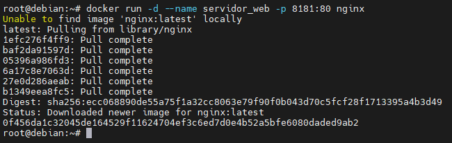
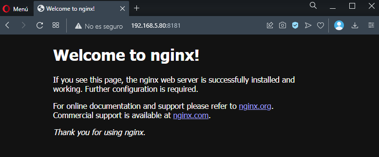
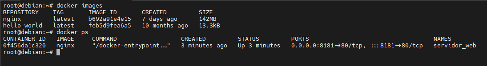
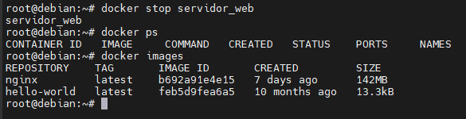
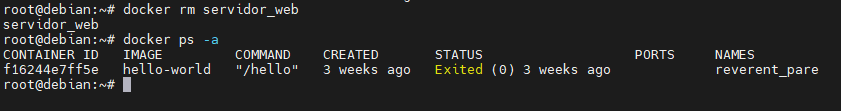

1. Pantallazo donde se vea la creación del contenedor y podamos comprobar que el contenedor está funcionando.

---
 

2. Pantallazo donde se vea el acceso al servidor web utilizando un navegador web (recuerda que tienes que acceder a la ip del ordenador donde tengas instalado docker)

---
 

3. Pantallazo donde se vean las imágenes que tienes en tu registro local.

---
 

4. Pantallazo donde se vea cómo se elimina el contenedor (recuerda que antes debe estar parado el contenedor).

---

---
 