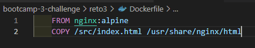
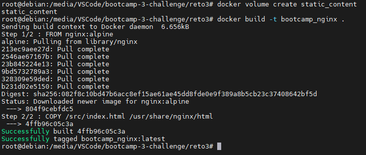
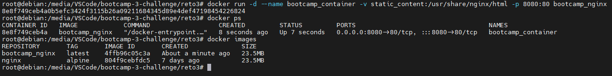
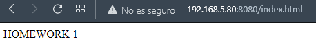
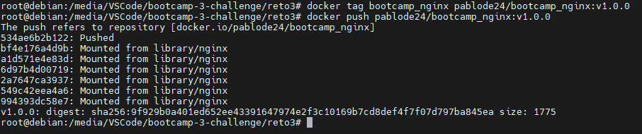
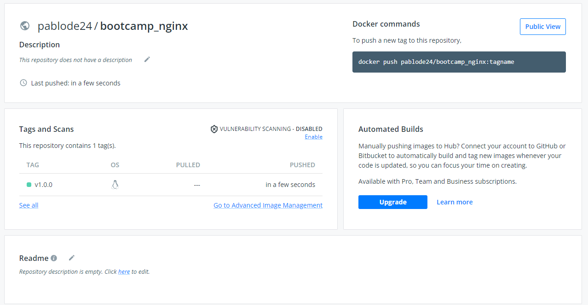

1. Paso 1: Crear el fichero Dockerfile.

---
 

2. Paso 2: Crear un volumen 'static_content'
3. Paso 3: Construir la imagen del contenedor. El nombre de la imagen es 'bootcamp_nginx'

---
 

4. Paso 4: Crear el contenedor	con nombre 'bootcamp_container' utilizando la imagen construida en el paso 3

---
 

5. Paso 5: Acceder a la URL http://localhost/8080/index.html y comprobar que aparece la pagina deseada

---
 

5. Paso 6: Deploy to Registry DockerHub

---

---
 