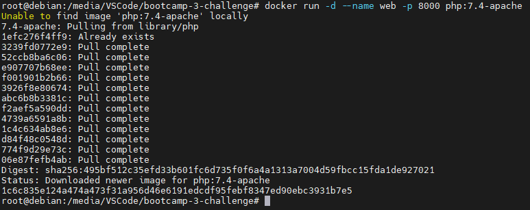
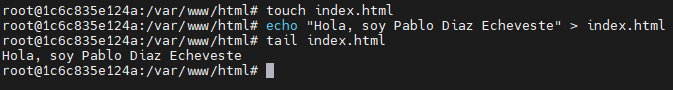
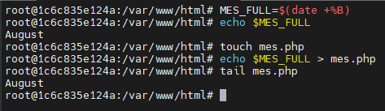

1. Arrancar un contenedor que ejecute la imagen php:7.4-apache, llamado web, por el puerto 8000.

---
 

2. Colocar en el directorio raíz del contenedor un archivo index.html que contenga 'HOLA SOY XXXXX' (nombre y apellidos).

---
 

3. Colocar en el mismo directorio otro archivo llamado llamado mes.php que muestre el mes actual, y ver la salida del script en el navegador.

---
 
